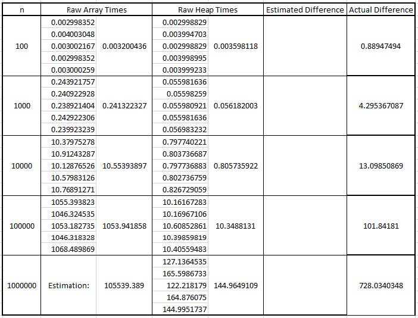
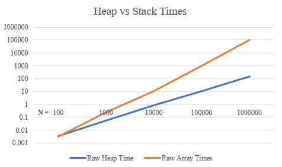

# Network Router

This projects is uses [Dijkstra's Algorithm](https://en.wikipedia.org/wiki/Dijkstra%27s_algorithm) to simulate a netwrok routing solution.
Random nodes with 3 weighted and directional edges are generated.
The goal is to connect any two given nodes in the most efficient way possible.
Additionally, a min heap is used to increase performance.

To see the implementation of Dijkstra's and the network router, see [NetworkRoutingSolver.py](NetworkRoutingSolver.py).

## Results

For the full report (such as Big-O complexity and explanation), see [Report.pdf](Network%20Routing%20-%20Report.pdf)

#### Size 200

#### Size 55

#### Data

